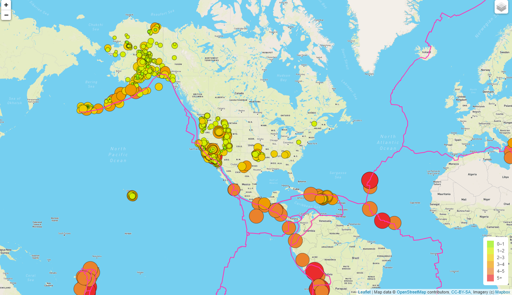

# 13-Mapping_Earthquakes
Module 13: Mapping Earthquakes with JS &amp; APIs

## Project/Challenge Overview

We've been tasked with displaying on a dynamic map webpage all the earthquakes that happened around the world in the last 7 days with different color codes and sizes by magnitude, and the tectonic plates. We can display 3 different map styles, and the info about earthquakes and tectonic plates as layer choices.

## Resources
- VS Code, HTML5, JavaScript, CSS, D3
- Earthquakes GeoJSON data: https://earthquake.usgs.gov/earthquakes/feed/v1.0/summary/all_week.geojson
- Trectonic Plates GeoJSON data: https://raw.githubusercontent.com/fraxen/tectonicplates/master/GeoJSON/PB2002_boundaries.json

## Overview

As shown by the different branches/folders in the GitHub repository, we plotted this map step by step. First by choosing a map tile layer, then have the 3 chosen ones (streets, Satelite Streets, Light) as a base layer.
            
            let baseMaps = {
	             "Streets": streets,
               "Satellite Streets": satelliteStreets,
               "Light": light
             };
When creating the map, we decided on the "streets" map layer to be displayed first.
            
            let map = L.map("mapid", {
              center: [39.5, -98.5],
              zoom: 3,
              layers: [streets]
              });
We created the 2 overlays, passed them into the layer control, whioch is then added to the map.

              let earthquakes = new L.layerGroup();  
              let tectonic = new L.layerGroup();
              let overlays = {
                  "Earthquakes": earthquakes,
                  "Tectonic Plates": tectonic
                };                
              L.control.layers(baseMaps, overlays).addTo(map);  
After retrieving both GeoJSON data, and adding it to each layer, we also added the layer straight to the map so they are displayed at launching. 

              earthquakes.addTo(map);
              tectonic.addTo(map);
We can then control to display them or not, as well as in which order to do so: at first the tectonic plates layer is displayed last so on top of the earthquake layer.

The earthquakes have been displayed as circles, with the pointToLayer method, and their radius and color differ depending on the magnitude. The tectonic plates are of bright color ("maroon1") and a weight of 2 to be seen on the 3 different maps. With the onEachLayer method, we added a popup to display info about each earthquake and tectonic plate.

 

These are the final displays for each map and both overlays shown.

  

  
